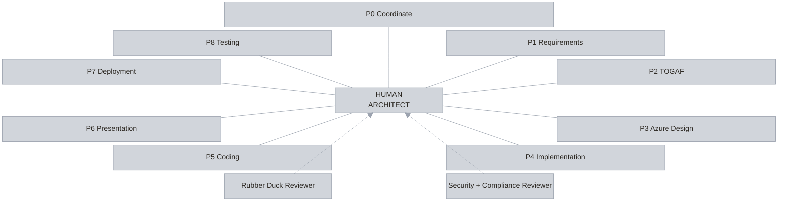
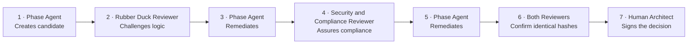

# Agentic Architecture v2

Agentic Architecture v2 is a human-centred architecture workflow that turns an architecture brief
into approved requirements, a TOGAF architecture, an implementation-ready Azure design, an
implementation plan, deployable code, and a C-level presentation.

The human architect remains accountable for every material decision and is the final approver of every
phase. Approvals are signed with a key only the architect can unlock, and the validator enforces phase
order from the records. Deployment and runtime testing are optional and always require separate human
invocation.

## See it first

**[▶ Open the interactive overview](https://aramsmith.github.io/agentic-architecture-v2/agentic-architecture-v2.html)**

The whole framework on one page: the governance ring, the five-stage start-up manual, the assurance
sequence, and the agent roster. Nothing to install, nothing to sign in to.

## Contributors

- [@aramsmith](https://github.com/aramsmith)
- [@FvanEgmond](https://github.com/FvanEgmond)

See [CONTRIBUTORS.md](CONTRIBUTORS.md) for the contributor policy and full list.

## Start here

- **[Ten-minute architect quick start](docs/quick-start.md)** — clone to verified synthetic evidence.
- [Representative Contoso Phase 0 evidence](docs/examples/contoso-phase-0-evidence.md)
- [Compatibility and support matrix](docs/compatibility.md)
- [Troubleshooting](docs/troubleshooting.md)
- [Release process and version policy](docs/release-process.md)
- [Contracts](docs/aff-contracts.md) and [renderer trust boundary](docs/aff-renderer.md)
- [Approval identity decision record](docs/decisions/approval-identity.html) — what a human approval
  proves, and what it does not
- [Contributing](CONTRIBUTING.md), [support](SUPPORT.md), [security](SECURITY.md), and
  [licence](LICENSE)

## Start-up manual

Five stages, in order. Each one is a safe stopping point.

### 1 · Install and prove it works

Offline. No GitHub Copilot, no Azure, no approval key, no credentials.

**Prerequisites:** Git, Node.js 22 or later, npm, Windows PowerShell.

```powershell
git clone https://github.com/aramsmith/agentic-architecture-v2.git
Set-Location .\agentic-architecture-v2
npm ci --no-audit --no-fund
npm run validate -- --framework-only
npm run smoke:contoso -- --keep-output .\.aff-smoke\contoso-review
Get-Content .\.aff-smoke\contoso-review\smoke-report.json
Invoke-Item .\.aff-smoke\contoso-review\cases\contoso-permit-services\solution-overview.html
```

**Success:** the framework validates, every offline assertion passes, the report records zero live model
calls and zero Azure actions, and the overview labels its approval as synthetic test evidence.

This proves the framework is internally consistent. It does **not** prove model quality, Azure access,
deployment, runtime behaviour, or real human approval. Delete `.\.aff-smoke\contoso-review` when done.

### 2 · Create your approval identity

Once, ever. This is the key that signs every phase decision you make.

```powershell
npm run identity:create
```

You choose a **label** — a role such as `Accountable architect` keeps a personal name out of case
folders — and a **passphrase**. The passphrase is never stored and cannot be recovered.

Creating the key also switches on a policy for this machine: a real human decision must be signed.
An identity is required for the approval command. Legacy `self-asserted` records remain readable on
machines without an identity; they are not an alternative approval-command workflow.

### 3 · Connect GitHub Copilot

Needed only for real cases. Requires Copilot access and the models in the roster below.

Open Copilot CLI from the repository root, then:

1. `/agent` — confirm `AFF-0-coordinator` is listed.
2. `/skills list` — confirm `grill-me` and `render-case-html`.

Agents load from `.github/agents/*.agent.md` and skills from `.github/skills/<skill-name>/SKILL.md`,
the locations GitHub documents for
[custom agents](https://docs.github.com/en/copilot/how-tos/copilot-cli/customize-copilot/create-custom-agents-for-cli)
and [project skills](https://docs.github.com/en/copilot/how-tos/copilot-cli/customize-copilot/add-skills).
Restart the CLI after changing an agent; use `/skills reload` after changing a skill.

In the GitHub Copilot app, select the repository and the branch holding the profiles, then pick
`AFF-0-coordinator`. Repository-wide discovery can require the profiles to be on the default branch.

### 4 · Start your first case

```powershell
New-Item -ItemType Directory .\cases\<case-name>\input
```

Add the architecture brief and supporting evidence. Use
`cases/_template/input/architecture-brief.md` as a starting point. **Never include credentials, tokens,
or unnecessary personal or regulated data.** Case folders stay local and are never committed.

Then invoke `AFF-0-coordinator`. Do not start with AFF-1: Phase 0 establishes the source inventory,
model plan, shared records, interview preparation, and review routing.

### 5 · Approve each phase, one at a time

Repeat this loop from Phase 0 through Phase 6.

1. **Read** the phase document, both reviewer records, the decisions, and the residual risks.
2. **Decide** — in your own terminal, with no agent session running:

   ```powershell
   npm run approve -- --case cases\<case-name> --phase 0
   ```

   It prints the artifact hashes and both final verdicts, then asks you to approve, reject, or cancel,
   and finally for your passphrase. It refuses to offer a decision the evidence does not support.

3. **Confirm** the case still holds, then continue to the next phase:

   ```powershell
   npm run validate -- --case cases\<case-name>
   ```

A phase cannot be entered, evidenced, or approved until its predecessor holds an approved decision.
Phases 7 and 8 are never automatic; they need separate human invocation.

**Current capability boundary:** Phases 7 and 8 remain unavailable to validated workflows until their
scoped authorisation and deployment-result contracts are implemented. Do not remove their prerequisites
to bypass this boundary. Phase 6 also requires an organisation-approved DECKIO installation and PDF
export capability; these are not installed by `npm ci`.

### Architect approval overview

Generate a local snapshot of all phases, approvals, rejections, recorded blockers, validation findings,
and recommended next actions:

```powershell
npm run render -- approvals --case cases/<case-name>
```

For an entirely synthetic example spanning Phases 0–6, run `npm run demo:approvals` and open
`.aff-smoke/approval-demo/cases/synthetic-standard-journey/approval-overview.html`. The example includes
a historical rejection and later approval. It tests record contracts, not live model quality, application
execution, or DECKIO/PDF export. Repeated runs require a new empty `--output` directory.

Open `cases/<case-name>/approval-overview.html`. Regenerate after evidence or decisions change. The
dashboard can show invalid cases for diagnosis, but never treats invalid evidence as permission to
continue. It does not sign decisions or execute commands. One architect still reviews and decides in
their own terminal; AFF-A and AFF-B remain agent reviewers.

Every new decision receives a unique file, preserving prior approvals and rejections. Reopening or
blocking a phase withdraws its old approval from downstream gates until a new decision is recorded.
See [approval remediation and migration](docs/migrations/approval-integrity.md) before continuing an
existing case.

> **Never type your passphrase into an agent conversation.** An agent that asks for it is phishing you,
> whatever its intent. Agents prepare, challenge, and evidence the work. You decide, alone.

For the fuller walkthrough with expected evidence and cleanup, see the
[quick start](docs/quick-start.md). For failures, see [troubleshooting](docs/troubleshooting.md).

## Interactive solution overview

- **[Open the interactive HTML solution overview](https://aramsmith.github.io/agentic-architecture-v2/agentic-architecture-v2.html)**

The interactive overview includes the animated architecture ring, phase model, reviewer roles, agent
roster, assurance sequence, and short operating manual.

After the first push, select **Settings → Pages → Source: GitHub Actions** if Pages is not already
enabled. The included workflow publishes both the site root and the explicit HTML file at the link
above.

## Approval assurance

Every recorded decision carries one of three modes, and the validator derives it from the evidence —
never from what the record claims about itself.

| Mode | What it means |
|---|---|
| `human-verified` | Signed by your approval key and unchanged since. |
| `self-asserted` | Recorded without verification of who decided. |
| `synthetic` | Generated by the offline harness. No human decision was made. |

The private key is passphrase-protected and stored in your user profile, outside the case and outside the
area agents work in. The signature covers the whole decision — phase, verdict, approver, time, artifact
hashes — so it cannot be lifted onto an altered record. Rejections are signed too.

An agent can still write an approval file; it simply cannot produce a valid one. See
[`docs/aff-contracts.md`](docs/aff-contracts.md) for the machine policy, key rotation, and the limits
that remain.

The repository also includes versioned JSON Schema contracts and a cross-platform validator, covering
structured records, safe paths, canonical SHA-256 bindings, reviewer convergence, phase order, and
approval bindings.

## Render case HTML

Use the deterministic renderer instead of model-authored HTML:

```powershell
npm run render -- phase --case cases\<case-name> --phase 0 `
  --source 0-coordination\<artifactPrefix>-coordination.md `
  --metadata 0-coordination\<artifactPrefix>-input-inventory.json 0-coordination\<artifactPrefix>-model-plan.json `
  --output 0-coordination\<artifactPrefix>-coordination.html

npm run render -- overview --case cases\<case-name>
```

See [`docs/aff-renderer.md`](docs/aff-renderer.md) for inputs, trust boundaries, limits, Mermaid behavior,
accessibility, and error remediation.

## Architecture ring



The human architect is central to every phase and reviewer relationship. Read the numbered phases in
order; the standard route ends with Phase 6. Phase 7 and Phase 8 are not automatic continuation steps.
The full canonical names and responsibilities are listed in the agent roster below.

## Phase assurance and approval sequence

**Independent challenge. Shared evidence. Human authority.**



Any material change invalidates prior hash-bound reviews. The human gate opens only when both reviewer
verdicts cover the same unchanged artifact hashes.

Step 7 happens outside the agent session. You run the approval command yourself, read the evidence it
prints, and unlock your key with a passphrase no agent can read. A phase also cannot be entered,
evidenced, or approved until its predecessor holds an approved decision — that order is enforced from the
records, not from agent behaviour.

## Agent roster

Do not edit this table directly. Run `npm run docs:generate` after changing the lifecycle manifest.

<!-- BEGIN GENERATED: AFF-LIFECYCLE-ROSTER -->
Lifecycle `2.0.0`; lifecycle-manifest schema `1.0.0`. Source: [`.github/agents/AFF-LIFECYCLE.json`](.github/agents/AFF-LIFECYCLE.json).

| ID | Agent profile | Display name | Model | Route or gate |
|---|---|---|---|---|
| AFF-0 | `AFF-0-coordinator` | Phase 0 — Coordinate | `gpt-5.6-sol` | Standard route to Phase 1 |
| AFF-1 | `AFF-1-requirements` | Phase 1 — Requirements | `gpt-5.6-sol` | Standard route to Phase 2 |
| AFF-2 | `AFF-2-togafarchitecture` | Phase 2 — TOGAF Architecture | `gpt-5.6-sol` | Standard route to Phase 3 |
| AFF-3 | `AFF-3-design` | Phase 3 — Azure Design | `gpt-5.6-sol` | Standard route to Phase 4 |
| AFF-4 | `AFF-4-implementation-plan` | Phase 4 — Implementation Plan | `gpt-5.6-sol` | Standard route to Phase 5 |
| AFF-5 | `AFF-5-coding` | Phase 5 — Coding | `gpt-5.3-codex` | Standard route to Phase 6 |
| AFF-6 | `AFF-6-presentation` | Phase 6 — C-level Presentation | `gpt-5.6-sol` | Standard route end |
| AFF-7 | `AFF-7-deployer` | Phase 7 — Deployment | `gpt-5.6-sol` | Optional; human invocation only. Requires: approved-phase-6, scoped-attempt-authorisation |
| AFF-8 | `AFF-8-testing` | Phase 8 — Runtime Testing | `gpt-5.3-codex` | Optional; human invocation only. Requires: phase-7-succeeded, approved-phase-7, scoped-test-attempt-authorisation |
| AFF-A | `AFF-A-rubber-duck` | Rubber Duck Reviewer | `gpt-5.4` | Independent model required |
| AFF-B | `AFF-B-security-compliance` | Security and Compliance Reviewer | `gpt-5.6-sol` | Independent assurance role |
<!-- END GENERATED: AFF-LIFECYCLE-ROSTER -->

## Core principles

- **Human-final governance:** agents prepare and challenge; the human decides and signs.
- **Independent review:** the Rubber Duck Reviewer uses a different GPT model from the phase agent.
- **Evidence-bound convergence:** both reviewers must cover identical artifact hashes.
- **Signed human decisions:** approvals and rejections are signed with a passphrase-protected key that no
  agent can use. On a machine holding that key, an unsigned decision is rejected.
- **Enforced phase order:** a phase cannot be entered, evidenced, or approved until its predecessor holds
  an approved decision.
- **Compact outputs:** each phase produces one authoritative Markdown document and safe HTML rendering.
- **No invented facts:** unknowns become explicit decisions, blockers, or owned assumptions.
- **Azure-ready, never reckless:** Bicep-first, parameterised environments, private databases, and no
  automatic deployment.
- **No stored deployment credentials:** use interactive Azure sign-in or an approved managed/runtime
  identity; GitHub OIDC is outside this solution.
- **Fail closed:** missing evidence, independence, scope, order, or approval stops progression.

## Model availability

Confirm every model in the generated roster is available in your Copilot host before the first case.

If one is unavailable, you must approve a GPT replacement and update the agent frontmatter,
`.github/agents/AFF-OPERATING-CONTRACT.md`, and `.github/agents/AFF-LIFECYCLE.json` together. The Rubber
Duck Reviewer must always differ from the phase agent. Run `npm run docs:generate` and the full
validation sequence after any substitution.

## Practise with Contoso

Contoso is Microsoft's familiar fictitious company name used in examples. The included Contoso Permit
Services case is entirely synthetic and contains no real company, customer, employee, subscription,
credential, or personal data.

Use `cases/contoso-permit-services/input/` to exercise Phase 0 and the opening of Phase 1 without Azure
access, deployment, or live testing. Its JSON expectations define the safety and routing conditions
that must hold. `npm run smoke:contoso` executes every expectation as an assertion.

## Outputs

Each phase produces one compact authoritative Markdown document and one safe self-contained HTML
rendering. Supporting catalogues, diagrams, code, and evidence remain separate. AFF-0 updates the
case-level `solution-overview.html` after each human-approved phase.

The overview states, per phase, whether the decision was signed, self-asserted, or synthetic. That label
is derived from verifying the signature, never from what the record claims about itself. A phase document
carries no approval of its own: it is generated before review, and re-rendering it afterwards would
change its hash and invalidate the decision bound to it.

Phase 5 creates and locally validates the Bicep/application package but never deploys. The human may
invoke AFF-7 later for one scoped deployment attempt and AFF-8 only after an approved successful
deployment.

## Repository structure

```text
.github/
  agents/
    AFF-OPERATING-CONTRACT.md
    AFF-LIFECYCLE.json
    AFF-0...AFF-8 agent profiles
    AFF-A and AFF-B reviewer profiles
  skills/
    grill-me/
    render-case-html/
cases/
  _template/
  contoso-permit-services/
docs/
  quick-start.md
  compatibility.md
  troubleshooting.md
  release-process.md
  decisions/
  migrations/
  examples/
  aff-contracts.md
  aff-renderer.md
schemas/
  aff/
src/
  approve/      human-run approval command
  case/         case record loading and contract validation
  common/
  docs/         generated documentation
  framework/    profile, lifecycle, and tool-policy validation
  identity/     approval key, signing, and verification
  render/       deterministic safe HTML
  schema/
  smoke/        offline Contoso harness
test/
agentic-architecture-v2.html
CHANGELOG.md
```

## Case-data safety

Real case folders are intentionally ignored by Git. Only the case template and synthetic Contoso case
are allowed into the repository. Keep real customer case data local and never commit or push it.

## Licence

Except where a component includes its own licence file, this repository is licensed under the
[Apache License 2.0](LICENSE). Component-level licences remain applicable to their components;
`.github/skills/grill-me/LICENSE` applies to the `grill-me` skill.

The published overview embeds its typefaces so the page stays self-contained: Inter for body text and
JetBrains Mono for headings, labels, and controls. Both are licensed under the SIL Open Font License 1.1;
see [`licenses/inter/OFL.txt`](licenses/inter/OFL.txt) and
[`licenses/jetbrains-mono/OFL.txt`](licenses/jetbrains-mono/OFL.txt).
