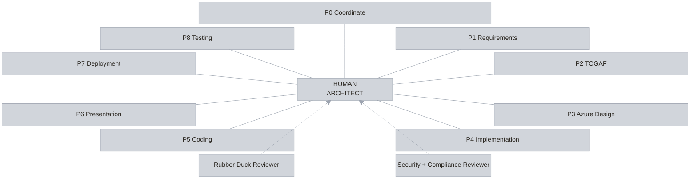
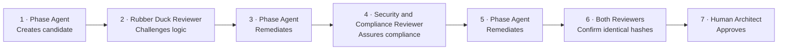

# Agentic Architecture v2

Agentic Architecture v2 is a human-centred architecture workflow that turns an architecture brief
into approved requirements, a TOGAF architecture, an implementation-ready Azure design, an
implementation plan, deployable code, and a C-level presentation.

The human architect remains accountable for every material decision and is the final approver of every
phase. Deployment and runtime testing are optional and always require separate human invocation.

## Start here

- **[Ten-minute architect quick start](docs/quick-start.md)** — clone to verified synthetic evidence.
- [Representative Contoso Phase 0 evidence](docs/examples/contoso-phase-0-evidence.md)
- [Compatibility and support matrix](docs/compatibility.md)
- [Troubleshooting](docs/troubleshooting.md)
- [Release process and version policy](docs/release-process.md)
- [Contracts](docs/aff-contracts.md) and [renderer trust boundary](docs/aff-renderer.md)
- [Contributing](CONTRIBUTING.md), [support](SUPPORT.md), [security](SECURITY.md), and [licence](LICENSE)

## Ten-minute local evaluation

**Prerequisites:** Git, Node.js 22 or later, npm, and Windows PowerShell. GitHub Copilot and Azure are
not required.

```powershell
git clone https://github.com/aramsmith/agentic-architecture-v2.git
Set-Location .\agentic-architecture-v2
npm ci --no-audit --no-fund
npm run validate -- --framework-only
npm run smoke:contoso -- --keep-output .\.aff-smoke\contoso-review
Get-Content .\.aff-smoke\contoso-review\smoke-report.json
Invoke-Item .\.aff-smoke\contoso-review\cases\contoso-permit-services\solution-overview.html
```

Success means the framework validates, the offline smoke assertions pass, the report records zero live
model calls and zero Azure actions, and the local overview labels its approval as synthetic test
evidence. This is a safe stopping point and a complete deterministic evaluation.

This path does **not** prove live model quality, Azure access, deployment, runtime behaviour, production
fitness, or real human approval. See the [full quick start](docs/quick-start.md) for optional Copilot
discovery, human-authorised Phase 7/8 boundaries, expected evidence, and cleanup.

## Interactive solution overview

- **[Open the interactive HTML solution overview](https://aramsmith.github.io/agentic-architecture-v2/agentic-architecture-v2.html)**

The interactive overview includes the animated architecture ring, phase model, reviewer roles, agent
roster, assurance sequence, and short operating manual.

After the first push, select **Settings → Pages → Source: GitHub Actions** if Pages is not already
enabled. The included workflow publishes both the site root and the explicit HTML file at the link
above.

## Optional GitHub Copilot use

AFF is packaged for GitHub Copilot CLI and the GitHub Copilot app:

- the 11 repository custom agents use `.github/agents/*.agent.md`;
- the two project skills use `.github/skills/<skill-name>/SKILL.md`;
- the operating contract and lifecycle manifest remain beside the profiles in `.github/agents/`.

These are the GitHub-documented locations for
[repository custom agents](https://docs.github.com/en/copilot/how-tos/copilot-cli/customize-copilot/create-custom-agents-for-cli)
and [project skills](https://docs.github.com/en/copilot/how-tos/copilot-cli/customize-copilot/add-skills).
Prerequisites are GitHub Copilot access, a current supported host, a clean clone or checkout of the
target branch, and access to the declared models. This is separate from the offline evaluation.

Open Copilot CLI from the repository root. It discovers project agents and skills from the checked-out
branch. If files change during a running session, restart the CLI to reload agents or use
`/skills reload` to reload skills.

To verify discovery in Copilot CLI:

1. Run `/agent` and confirm `AFF-0-coordinator` is available.
2. Run `/skills list`, then `/skills info grill-me` and `/skills info render-case-html`.
3. Select `AFF-0-coordinator`, or run:

   ```powershell
   copilot --agent=AFF-0-coordinator --prompt "State only the custom agent profile name. Do not read or modify files." --silent
   ```

In the GitHub Copilot app, select this repository and the branch containing the profiles, then select
`AFF-0-coordinator` from the agent dropdown. Skills have no separate app selector: Copilot loads them
when the prompt and the skill description match, or when a profile explicitly references the skill.
Repository custom agents must be on the default branch for normal repository-wide app discovery.

The repository includes versioned JSON Schema contracts and a cross-platform validator. Use
`npm run validate -- --case cases/<case-name>` for a local case. It checks structured records, safe
paths, canonical SHA-256 bindings, final reviewer convergence, and human approval bindings. See
[`docs/aff-contracts.md`](docs/aff-contracts.md).

## Render case HTML

Use the deterministic renderer instead of model-authored HTML:

```powershell
npm run render -- phase --case cases\<case-name> --phase 0 `
  --source 0-coordination\<artifactPrefix>-coordination.md `
  --metadata 0-coordination\<artifactPrefix>-input-inventory.json 0-coordination\<artifactPrefix>-model-plan.json `
  --output 0-coordination\<artifactPrefix>-coordination.html

npm run render -- overview --case cases\<case-name>
```

See [`docs/aff-renderer.md`](docs/aff-renderer.md) for inputs, trust boundaries, limits, Mermaid behavior,
accessibility, and error remediation.

## Architecture ring



The human architect is central to every phase and reviewer relationship. Read the numbered phases in
order; the standard route ends with Phase 6. Phase 7 and Phase 8 are not automatic continuation steps.
The full canonical names and responsibilities are listed in the agent roster below.

## Phase assurance and approval sequence

**Independent challenge. Shared evidence. Human authority.**



Any material change invalidates prior hash-bound reviews. The human gate opens only when both reviewer
verdicts cover the same unchanged artifact hashes.

## Agent roster

Do not edit this table directly. Run `npm run docs:generate` after changing the lifecycle manifest.

<!-- BEGIN GENERATED: AFF-LIFECYCLE-ROSTER -->
Lifecycle `2.0.0`; lifecycle-manifest schema `1.0.0`. Source: [`.github/agents/AFF-LIFECYCLE.json`](.github/agents/AFF-LIFECYCLE.json).

| ID | Agent profile | Display name | Model | Route or gate |
|---|---|---|---|---|
| AFF-0 | `AFF-0-coordinator` | Phase 0 — Coordinate | `gpt-5.6-sol` | Standard route to Phase 1 |
| AFF-1 | `AFF-1-requirements` | Phase 1 — Requirements | `gpt-5.6-sol` | Standard route to Phase 2 |
| AFF-2 | `AFF-2-togafarchitecture` | Phase 2 — TOGAF Architecture | `gpt-5.6-sol` | Standard route to Phase 3 |
| AFF-3 | `AFF-3-design` | Phase 3 — Azure Design | `gpt-5.6-sol` | Standard route to Phase 4 |
| AFF-4 | `AFF-4-implementation-plan` | Phase 4 — Implementation Plan | `gpt-5.6-sol` | Standard route to Phase 5 |
| AFF-5 | `AFF-5-coding` | Phase 5 — Coding | `gpt-5.3-codex` | Standard route to Phase 6 |
| AFF-6 | `AFF-6-presentation` | Phase 6 — C-level Presentation | `gpt-5.6-sol` | Standard route end |
| AFF-7 | `AFF-7-deployer` | Phase 7 — Deployment | `gpt-5.6-sol` | Optional; human invocation only. Requires: approved-phase-6, scoped-attempt-authorisation |
| AFF-8 | `AFF-8-testing` | Phase 8 — Runtime Testing | `gpt-5.3-codex` | Optional; human invocation only. Requires: phase-7-succeeded, approved-phase-7, scoped-test-attempt-authorisation |
| AFF-A | `AFF-A-rubber-duck` | Rubber Duck Reviewer | `gpt-5.4` | Independent model required |
| AFF-B | `AFF-B-security-compliance` | Security and Compliance Reviewer | `gpt-5.6-sol` | Independent assurance role |
<!-- END GENERATED: AFF-LIFECYCLE-ROSTER -->

## Core principles

- **Human-final governance:** agents prepare and challenge; the human decides and approves.
- **Independent review:** the Rubber Duck Reviewer uses a different GPT model from the phase agent.
- **Evidence-bound convergence:** both reviewers must cover identical artifact hashes.
- **Compact outputs:** each phase produces one authoritative Markdown document and safe HTML rendering.
- **No invented facts:** unknowns become explicit decisions, blockers, or owned assumptions.
- **Azure-ready, never reckless:** Bicep-first, parameterised environments, private databases, and no
  automatic deployment.
- **No stored deployment credentials:** use interactive Azure sign-in or an approved managed/runtime
  identity; GitHub OIDC is outside this solution.
- **Fail closed:** missing evidence, independence, scope, or approval stops progression.

## Before the first case

Confirm every model in the generated roster is available in the selected Copilot host.

If a model is unavailable, the human must approve a GPT replacement and update agent frontmatter,
`.github/agents/AFF-OPERATING-CONTRACT.md`, and `.github/agents/AFF-LIFECYCLE.json` consistently. The
Rubber Duck Reviewer must always use a different model from the phase agent. Run
`npm run docs:generate` and the complete validation sequence after any approved substitution.

## Start a use case

1. Create `cases/<case-name>/input/`.
2. Add the architecture brief and supporting evidence. Use
   `cases/_template/input/architecture-brief.md` when useful.
3. Do not include credentials, tokens, or unnecessary personal or regulated data.
4. Invoke `AFF-0-coordinator`.
5. Review the Phase 0 output, both reviewer records, decisions, and residual risks.
6. Approve only when both reviews cover the same final artifact hashes.
7. Continue one approved phase at a time through Phase 6.

Do not start directly with AFF-1. AFF-0 establishes the source inventory, model plan, shared records,
interview preparation, review routing, and cumulative solution overview.

## Practise with Contoso

Contoso is Microsoft's familiar fictitious company name used in examples. The included Contoso Permit
Services case is entirely synthetic and contains no real company, customer, employee, subscription,
credential, or personal data.

Use `cases/contoso-permit-services/input/` to exercise Phase 0 and the opening of Phase 1 without Azure
access, deployment, or live testing. Its JSON expectations define the safety and routing conditions
that must hold. `npm run smoke:contoso` executes every expectation as an assertion.

## Outputs

Each phase produces one compact authoritative Markdown document and one safe self-contained HTML
rendering. Supporting catalogues, diagrams, code, and evidence remain separate. AFF-0 updates the
case-level `solution-overview.html` after each human-approved phase.

Phase 5 creates and locally validates the Bicep/application package but never deploys. The human may
invoke AFF-7 later for one scoped deployment attempt and AFF-8 only after an approved successful
deployment.

## Repository structure

```text
.github/
  agents/
    AFF-OPERATING-CONTRACT.md
    AFF-LIFECYCLE.json
    AFF-0...AFF-8 agent profiles
    AFF-A and AFF-B reviewer profiles
  skills/
    grill-me/
    render-case-html/
cases/
  _template/
  contoso-permit-services/
docs/
  quick-start.md
  compatibility.md
  troubleshooting.md
  release-process.md
  migrations/
  examples/
  aff-contracts.md
  aff-renderer.md
src/
  docs/
  render/
  smoke/
test/
agentic-architecture-v2.html
CHANGELOG.md
```

## Case-data safety

Real case folders are intentionally ignored by Git. Only the case template and synthetic Contoso case
are allowed into the repository. Keep real customer case data local and never commit or push it.

## Licence

Except where a component includes its own licence file, this repository is licensed under the
[Apache License 2.0](LICENSE). Component-level licences remain applicable to their components;
`.github/skills/grill-me/LICENSE` applies to the `grill-me` skill.
